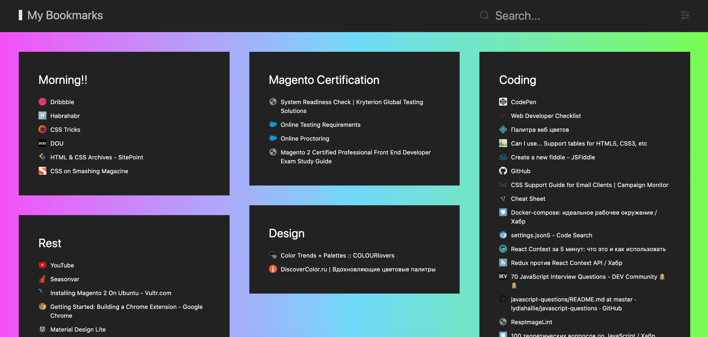

# CS useful Bookmarks

This project is Chrome extension which shows user's GChrome bookmarks in a start tab as a bunch of cards.



### Build on your machine

You need to have [NodeJS](https://nodejs.org) and [Yarn](https://yarnpkg.com) pre-installed. When they're ready, clone this repository and type these commands in your terminal:

```
$ cd <repository root directory>
$ yarn install
$ yarn build
```

When the project is succesfully built open Google Chrome. Go to Menu -> More Tools -> Extensions. At the top of screen click "Load unpacked extenstion". If there is no similar button - tick the checkbox "Developer mode" on the top right. Then choose the directory

``` <repository root directory>/build ```

The extenstion will appear in the new Chrome tab.

---

## TODOs

+ Add extension configuration (configure appearance, bookmarks structure and order)
+ Drag and drop folders to reorder
+ Drag and drop bookmarks to move between folders
+ Search: open bookmark on submit, if there is only one result

